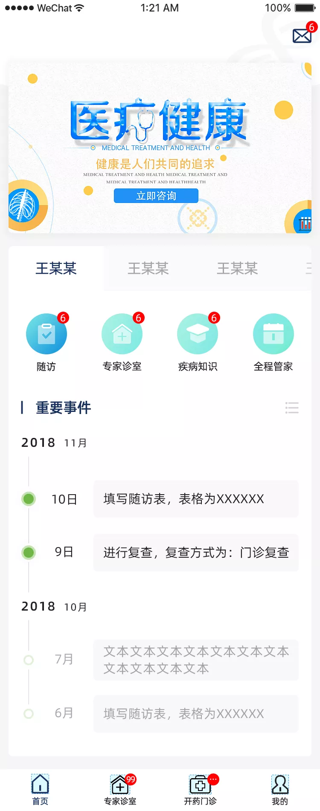

# 更多项目展示

## 1，大疆传媒官网+后台管理系统
* 项目背景：大疆传媒官网换新,我司承担外包工作进行开发.
* 技术选型：前端React+[Antd](https://ant.design/index-cn)+[WOW.js](https://www.delac.io/wow/), 后台管理Vue+[Vue-element-admin](https://panjiachen.github.io/vue-element-admin-site/zh/) +[Element-ui](https://element.eleme.cn/#/zh-CN)
* 负责内容：根据甲方提供原型图分析需求,提供技术选型方案,实现响应式方案,完美适配超宽屏与手机端H5.
* 线上地址：[DJI Studio 大疆传媒](https://studio.dji.com/)
- - - -

## 2，小仙炖会员及周期管理小程序
* 项目背景：小仙炖鲜炖燕窝方便客户对订单进行管理,提出小程序开发需求,我司承担外包工作进行开发.
* 技术选型：前端[uni-app](https://uniapp.dcloud.io/),后台管理Vue+Vue-element-admin+Element-ui
* 负责内容：独立完成会员中心小程序及周期管理工具小程序开发.
* 线上地址： 

会员小程序 | 周期修改小程序
 -------------|-------------
 | 

- - - -

## 3，走鸭分时租赁APP，类似GoFun租车
* 项目背景：五菱集团牵头,提供两种车型,在南京高校附近提供租车服务,也为今后推出新车方便推广.
* 技术选型：甲方指定Flutter框架,通过Flutter Plugin接入原生功能
* 负责内容：主导项目开发,负责功能模块任务的分配,监管项目进度,完成租车主体流程,实现页面及操作动效,通过Plugin实现原生地图展示及交互功能、原生支付宝支付和微信支付、原生蓝牙钥匙功能、原生Face++功能
* 线上地址：还未上线

原型UI | 原型UI
 -------------|-------------
 | 
 | 

- - - -
## 4，遇见未来星H5
* 项目背景：通过选择题推算用眼指数,宣传健康用眼,最后根据用户选择的职业生成海报,2019进博会期间会场大屏展示
* 技术选型：前端Cocos creator,海报合成服务由Spring boot实现
* 负责内容：独立完成前端项目和海报合成服务
* 线上地址：[H5线上地址](http://ciie.essilorchina.com/) [海报合成接口](https://yjwlx.jerrysir.com/poster/g?name=Jerry&type=4)

原型UI | 原型UI
 -------------|-------------
 | 
 | 

- - - -
## 5，红旗电召App，类似滴滴出行
* 项目背景：小城市电召叫车服务,实现司机端和乘客端,乘客可通过电话和APP两种下单方式叫车
* 技术选型：前端uni-app
* 负责内容：独立完成双端APP,项目开发过程中协助官方定位并修复语音播放bug
* 线上地址：[司机端iOS地址](https://apps.apple.com/cn/app/红旗电召/id1487791533) [乘客端iOS地址](https://apps.apple.com/cn/app/红旗电召/id1489038666)

- - - -
## 6，XX消防在线请假系统APP
* 项目背景：某地区消防局提供在线请假、审批功能的APP
* 技术选型：前端uni-app
* 负责内容：协助同事完成核心功能,实现地图选址、后台实时打点功能
* 线上地址：安卓部署在内网,iOS未上线

- - - -
## 7，医生在线问诊APP
* 项目背景：医生与患者之间提供在线咨询服务,在线回访服务
* 技术选型：前端uni-app+web socket
* 负责内容：协助同事完成核心功能,实现聊天功能,根据接口实现自定义表单功能
* 线上地址：未上线

原型UI | 原型UI
 -------------|-------------
 | 
 | 

- - - -
## 8，1C9U文库平台+后台管理系统
* 项目背景：类似百度文库,前端web提供文档部分预览、付费购买服务,小程序实现web同功能
* 技术选型：前端web由Vue+Antd,小程序uni-app,后台管理Vue+Vue-element-admin+Element-ui
* 负责内容：协助同事完成主要功能,完成文档预览web及小程序功能,完成海报合成服务
* 线上地址：[Web线上地址](https://www.1c9u.com/)
- - - -
## 9，Instaco 海外电商平台+后台管理系统
* 项目背景：类似海外Shopify电商网站前端及管理后台,通过网红直播带货
* 技术选型：Vue+Element-ui
* 负责内容：独立完成后台管理项目,协助完成前端商品图片打点功能和Google埋点统计功能
* 线上地址：
- - - -
## 10，报春资讯APP
* 项目背景：提供钢铁资讯服务,实时报价及价格走势服务
* 技术选型：Weex+Hybrid
* 负责内容：主要页面及iOS Hybrid功能,实现原生Echarts集成
* 线上地址：[iOS线上地址](https://apps.apple.com/cn/app/报春资讯/id1067210911)
- - - -
## 11，平安到家小程序+服务
* 项目背景：郑州顺风车事件之后,对事件前后了解之后,技术出身的自己想为社会做点什么,后来做了一款可以实时定位的小程序,行程中位置实时上报,可通过小程序分享给亲朋好友,朋友通过小程序链接可查看当前所在的位置
* 技术选型：前端Taro,后端服务Go+Beego(原Pomelo)
* 负责内容：独立完成前端及后端服务
* 线上地址：

- - - -